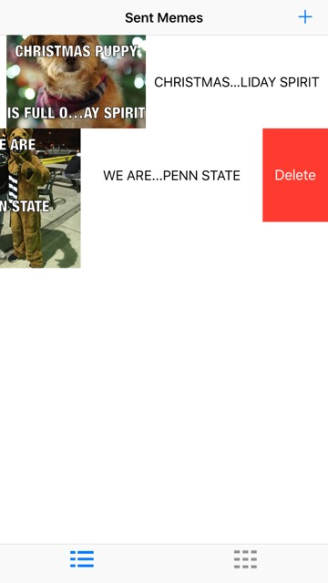

# MemeMeV2
MemeMe App V 2.0

This is a repository for version 2.0 of the MemeMe app for Udacity's iOS Developer
Nanodegree.

MemeMe is a Swift iOS app that can be used to create image macro memes. See the Wikipedia
page here for more details on image macros: https://en.wikipedia.org/wiki/Image_macro. 
Users can create memes from pictures in the device's album or by taking pictures with the
camera.  The app also allows users to share a meme using the iOS activity controller.

Saved memes are displayed in two ways, a table view and a collection view.  Users can
switch between the two views via the tab bar at the bottom.  The table view allows users
to delete a saved meme by swiping to the left.

##Screenshots

The initial screen is the empty table view:

Pressing the "+" button in the top right brings up the meme editor:

Images can be added to the meme using the album or camera button, and the top and bottom 
text fields can be changed:

The created meme can be shared with others using the button in the top left:

After sharing, memes are saved in the Sent Memes view:

Memes can be deleted from the table view by swiping to the left:

Saved memes can also be viewed in a collection view:

Pressing on a meme in either view brings up the meme detail view to view the full image.

Pressing the edit button brings up the meme editor again.
